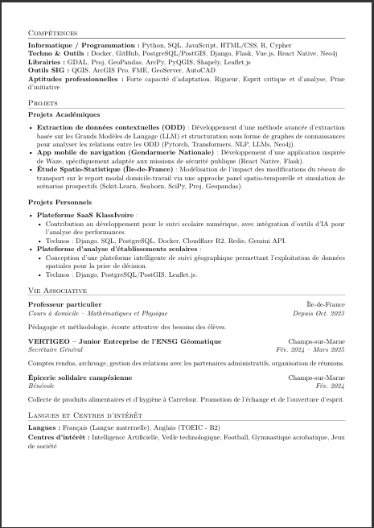
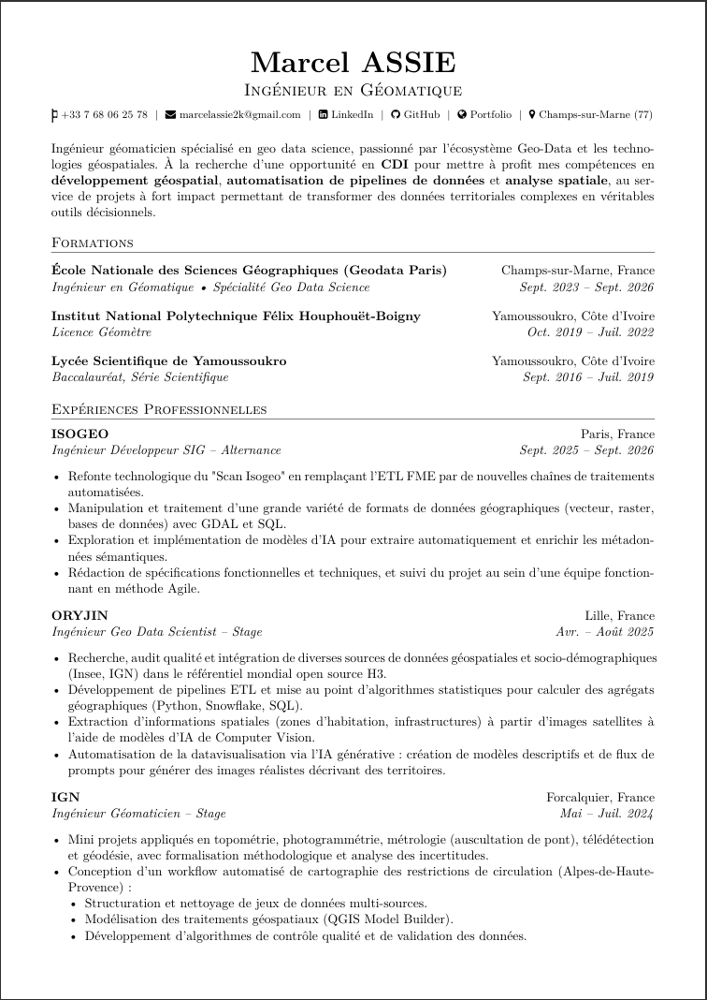

# CV Marcel Assie
---

Ce CV présente le parcours professionnel et académique de Marcel Assie, ingénieur en géomatique spécialisé dans le développement géospatial et l'analyse de données. Le document met en valeur ses compétences en Python, SQL, et les outils SIG, ainsi que ses expériences chez des entreprises comme ISOGEO et ORYJIN.

# Screenshots
---

<table>
  <tr>
    <td style="text-align: center;">
      
       <em>Page 1</em>
    </td>
    <td style="text-align: center;">
      
       <em>Page 2</em>
    </td>
  </tr>
</table>

## Auteur

**Marcel Assie**  
Ingénieur Géomatique

- [LinkedIn](https://www.linkedin.com/in/marcel-assie/)
- [GitHub](https://github.com/MarcelAssie/)
